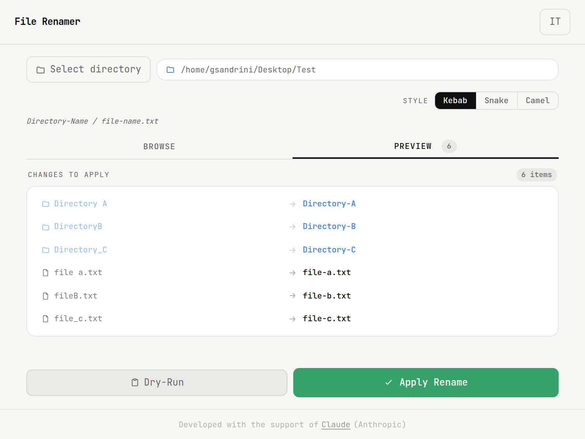

# File Renamer

Desktop app for renaming files and directories

## Screenshot



---

## Features

- Native directory picker
- Content preview in the Browse tab
- Dry-run mode with changes preview in the Preview tab
- One-click rename application
- Multilingual support (IT / EN)
- Automatic light/dark theme

---

## Naming transformation rules

The tool supports multiple naming conventions for directories and files:

### kebab-case
```
Directory-Name / file-name.txt
```

### snake_case
```
Directory_Name / file_name.txt
```

### camelCase
```
DirectoryName / fileName.txt
```

---

## Install

```bash
curl -fsSL https://github.com/gsandrini/file-renamer/releases/latest/download/install.sh | bash
```

---

### Uninstall

```bash
curl -fsSL https://github.com/gsandrini/file-renamer/releases/latest/download/install.sh | bash -s -- --uninstall
```

---

## Tech stack

- [Wails](https://wails.io) - Desktop framework (Go + WebView)
- [Go](https://golang.org) - Backend logic
- [Alpine.js](https://alpinejs.dev) - Reactive UI (bundled locally)
- [Tailwind CSS](https://tailwindcss.com) - Styling (compiled locally)
- [JetBrains Mono](https://www.jetbrains.com/lp/mono/) - Typography

---

## Built with

This project was built with the support of [Claude](https://claude.ai) by Anthropic.

---

## Contributing

This repository is published for personal use / GitHub Pages only.
Pull requests and issues will not be reviewed or accepted.

---

## License

This project is licensed under the **GNU General Public License v3.0**.
See the [LICENSE](LICENSE) file for details.